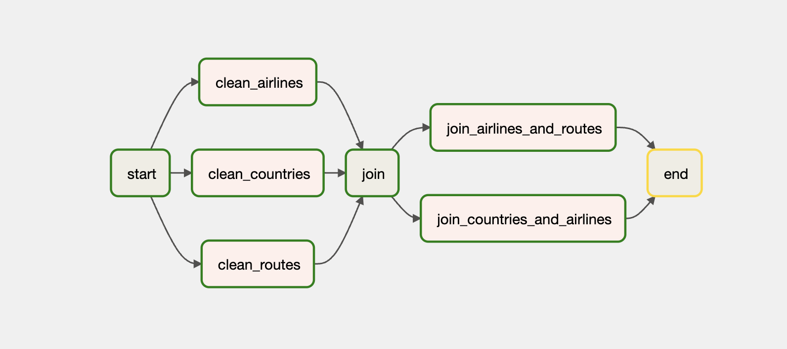

# Project Description
This project is to build an end-to-end data pipeline for visualizing flights data. Every day, many airlines are operating various flights. This project's aim is to visualize few pattners like:
1. Which country holds most number of airlines (international plus domestic)
2. Which airline operates frequently ?

# Dataset selection
I have selected Open Flights Data `https://openflights.org/data.html` from the recommended datasets page: https://github.com/DataTalksClub/data-engineering-zoomcamp/blob/main/week_7_project/datasets.md

# Followed pipeline creation steps:
1. Copy data into data lake (GCP buckets)
2. Clean data (Apache Airflow Tasks)
3. Move data from the data lake to data warehouse (GCP buckets & setup BigQuery)
4. Create a analytical report

THhe final dashboard should consists of atleast two widgets.


## Project Requirements
* `Python >= 3.8`
* `gcloud CLI`

See [requirements.txt](./requirements.txt) for more requirements

## Running instructions (Local)
First, create a virtual environment locally, using command:
```bash
python3 -m venv venv
```

Then from terminal, activate the environment like this:
```bash
source venv/bin/activate
```

Once python environment is activated, run below command on terminal:
```bash
pip install --upgrade pip
pip install -r requirements.txt
```

Then one can launch a Jupyter server like this:
```bash
jupyter notebook
```

## Architecture
The applcation is split into two parts:
1. Infrastructure
2. Apache Airflow

We follow medallion architecture to generate gold tables from bronze and silver. 

* Bronze -> Raw data
* Silver -> Cleansed & Transformed
* Gold -> Final tables for vaisualization

The initial data on Data lake (bucket) will be bronze. Airflow tasks will create silver tables out of these raw data. Then another set of tasks create gold tables by joining silver tables.


### Infrastructure
To spin up a GCP bucket for Datalake and BigQuery dataset for data warehouse, please run below command from the `infrastructure` directory.

**Note**: Please make sure you have setup the GCP project already, and configured gcloud CLI tool. Please see instructions to install gcloud on your platform here: https://cloud.google.com/sdk/docs/install

```bash
terraform init
terraform apply --auto-approve
```
This step creates following resources on GCP:
1. Bigquery dataset & tables
2. GCP Bucket for compose
3. Composer environment (for Airflow tasks)

Once the infrastructure is setup and no errors from terraform, make sure to grant owner permissions to use Composer and GCP buckets.

## Apache Airflow
The code for airflow DAGs is in [dags/](./dags/) directory. The file [pipeline.py](./dags/pipeline.py) is responsible for defining airflow tasks. It has tasks for:
1. Cleansing data
2. Transforming data
3. Gold table generation


## Query Data Warehouse (using Big Query)
Once gold tables are generated, one can visualize the data from Bigquery from here:
https://console.cloud.google.com/bigquery?project=ue-assignment-375918

Note: This dataset and tables are created by Terraform already.

## Create reports using Looker Studio
Now manually, create a report in looker studio: https://lookerstudio.google.com/u/0/navigation/reporting

Dashboard: https://lookerstudio.google.com/u/0/reporting/f7e9eb77-e1ef-4f07-a24d-4c9390f813d5/page/tEnnC


## Limitations
1. Terraform state is currently using local backend
2. Final reports are not created via Terraform
